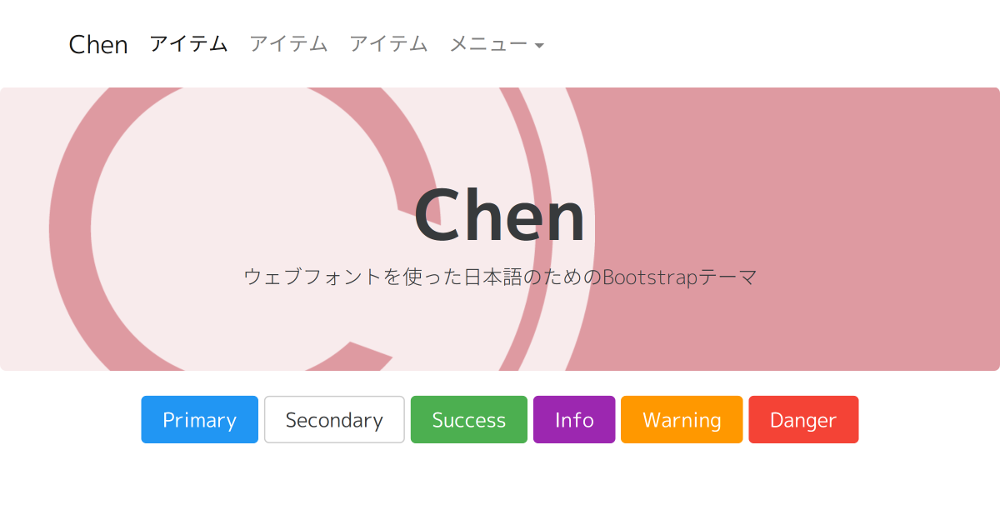

# Chen

[](https://travis-ci.org/tamaina/Chen)
[](https://ci.appveyor.com/project/tamaina/chen/branch/master)
[](https://david-dm.org/tamaina/Chen#info=devDependencies)
]
[](LICENSE)

[https://tamaina.github.io/Chen/](https://tamaina.github.io/Chen/)

[](https://tamaina.github.io/Chen/)

"Chen" は日本語も美しく表示できるBootstrapテーマです。

## About "Chen"

通常の[Bootstrap](http://getbootstrap.com/)では、日本語のフォント指定や文字サイズは最適とはいえません。"Chen"のベースとなった["Honoka"](honokak.osaka)は、そんなBootstrapをベースに、日本語表示に適したフォント指定や、文字サイズに関するコードを追記したBootstrapテーマの一つです。

"Chen"では、日本語JIS第2水準漢字まで対応のウェブフォントが付加されています。(英字フォントもちゃっかりM+ pに置き換わっています。)

きれいに日本語を表示したいけれど、游ゴシックが嫌いな方は、どうぞお使いください。

名前に意味は特にないです。そういう風潮だったので適当に東方Projectからキャラクターの名前を選んだだけです。

## Live Demo

 * [https://tamaina.github.io/Chen/bootstrap-ja.html](https://tamaina.github.io/Chen/bootstrap-ja.html) (日本語レイアウト)
 * [https://tamaina.github.io/Chen/bootstrap.html](https://tamaina.github.io/Chen/bootstrap.html) (英語レイアウト)

## Getting Started

### Download

[Releases](https://github.com/tamaina/Chen/releases)から最新版をダウンロードしてください。

### Bower

[Bower](http://bower.io/)からインストールすることができます。パッケージ名は**Chen**です。

以下のコマンドを実行してください。

```
bower install --save-dev Chen
```

## Usage

Chenは単なるBootstrapテーマにしか過ぎないため，基本的な使い方は本家Bootstrapとほとんど変わりません。よって以下に書くことは[本家Bootstrap](http://getbootstrap.com/getting-started/)からの引用，もしくはその一部を変更したものです。用意されたCSSクラスやコンポーネントなど，より詳細な使い方のドキュメントは本家Bootstrapの各種リファレンスページをご覧になることを推奨します。

 * [CSS](http://getbootstrap.com/css/)
 * [Components](http://getbootstrap.com/components/)
 * [JavaScript](http://getbootstrap.com/javascript/)

### Package

配布しているzipファイルの内容物は以下のとおりです。``bootstrap.min.*``といったように，ファイル名に``min``がつくファイルは，改行やインデント・スペーシングをなくした(minifyされた)コードで，ユーザがウェブページを読み込む際の転送量を少なくすることができます。通常はこの``bootstrap.min.*``を使うことをおすすめします。

```
master/
├─ index.html
├─ bootstrap.html
├─ bootstrap-ja.html
├─ README.md (このファイル)
├─ css/
│   ├─ bootstrap.css
│   └─ bootstrap.min.css
├─ fonts/
│   ├─ glyphicons-halflings-regular.eot
│   ├─ glyphicons-halflings-regular.svg
│   ├─ glyphicons-halflings-regular.ttf
│   ├─ glyphicons-halflings-regular.woff
│   └─ glyphicons-halflings-regular.woff2
└─ js/
     ├─ bootstrap.js
     └─ bootstrap.min.js
```

### Basic Template

Bootstrapをつかってウェブページを作成する際に基本となるHTML部分は以下のようになります。CSSやJavaScriptのファイルパスは環境に合わせて変更する必要があります。

Chen v3.9.10現在の雛形です。 **v4.0.0へ更新する際、変更が必要になります。**

```html
<!DOCTYPE html>
<html lang="ja">
  <head>
    <meta charset="utf-8">
    <meta http-equiv="X-UA-Compatible" content="IE=edge">
    <meta name="viewport" content="width=device-width, initial-scale=1">
    <!-- 上記のmetaタグは *絶対に必要です*. head内に含める他のタグは *これ以降* に書かなければなりません。 -->
    <title>Bootstrap 雛形</title>

    <!-- Bootstrap -->
    <link href="css/bootstrap.min.css" rel="stylesheet">

    <!-- HTML5 shiv と Respond.js はIE8にHTML5エレメントとmedia queriesをサポートさせます。 -->
    <!-- 警告: Respond.js はローカル環境(file://から始まるURL)で見る時機能しません。 -->
    <!--[if lt IE 9]>
      <script src="https://cdnjs.cloudflare.com/ajax/libs/html5shiv/3.7.3/html5shiv.min.js"></script>
      <script src="https://cdnjs.cloudflare.com/ajax/libs/respond.js/1.4.2/respond.min.js"></script>
    <![endif]-->
  </head>
  <body>
    <h1>Hello, world!</h1>

    <!-- bodyの一番最後 -->
    <!-- jQuery (Bootstrapのjavascriptを動かす為に必要です。) -->
    <script src="https://cdnjs.cloudflare.com/ajax/libs/jquery/1.12.4/jquery.min.js"></script>
    <!-- 下記はすべてのプラグインを収めたファイルですが、必要に応じて個別のファイルを導入します。 -->
    <script src="js/bootstrap.min.js"></script>
  </body>
</html>
```

### Do you hate WebFont?

WebFontを利用したくない場合は、fork元の[Honoka](http://honokak.osaka)をご利用ください。

というか、これを使うとどう足掻いても3MBの読み込みが必須になるため、使うのは良くないと思います(じゃあなぜ公開したし)。

[このあたりでWebFontを軽くする(見せる)方法を紹介してたりします。](https://tamaina.github.io/The-Japanese-Web-Fonts/#!HowToSet.md)

## License

[MIT License](LICENSE)

## Author

 * windyakin ([windyakin.net](http://windyakin.net/))

## Editor

 * tamaina ([tamaina.github.io](https://tamaina.github.io/))